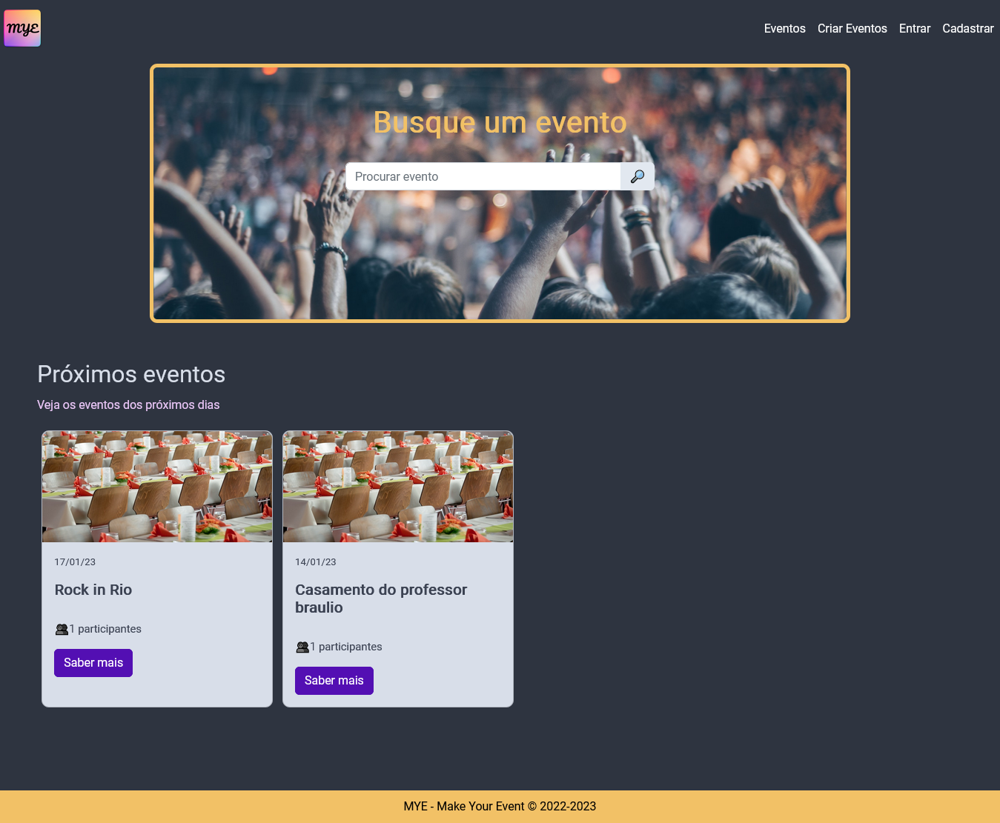
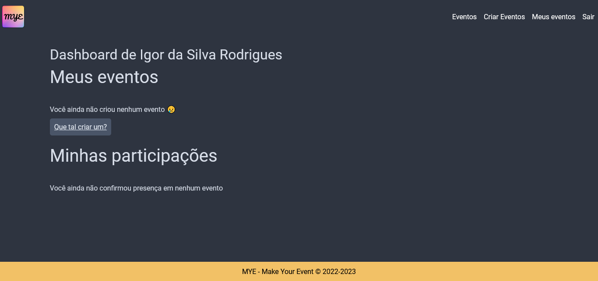
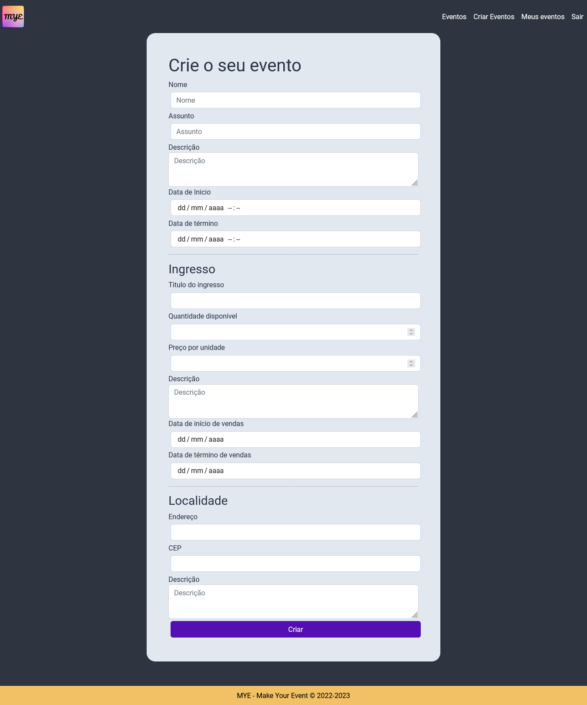

# MYE
Make Your Event

Um site de compartilhamento de eventos.

## Requisitos

- PHP 8.1.12
- Node.js 18.12.1

## Executando
Para executar a aplicação, navegue até a pasta raiz do projeto ```.\MYE ``` e execute os seguintes comandos<br>
- ``` php artisan migrate ```
- ``` npm run dev ```
- ``` php artisan serve ```

## Autores

- Igor da Silva Rodrigues
- Gabriel Rodrigues dos Santos

## Imagens

#### Pagina inicial


#### Pagina de usuário


#### Formulário de cadastro de evento

